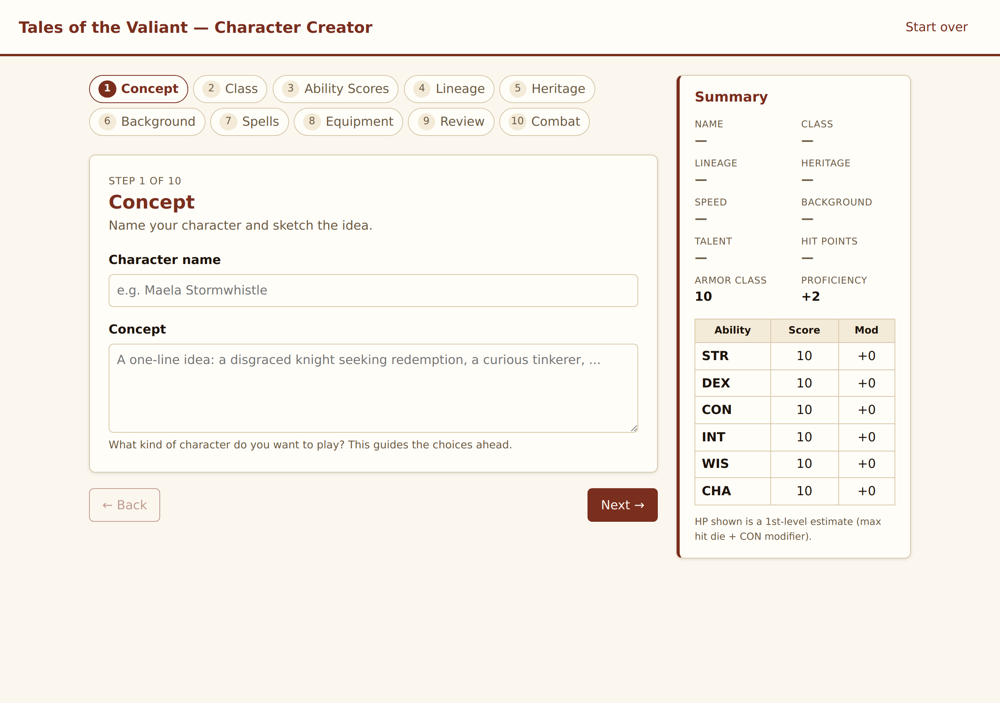

# ToV Character Creator

A web-based character creation tool for the **Tales of the Valiant (ToV)** roleplaying
game. It walks a player through building a complete 1st-level character — class, ability
scores, lineage, heritage, background, talents, skills, spells, and equipment — computes
the derived stats and combat numbers, and produces an exportable/printable character
sheet, entirely in the browser.

> **Status:** feature-complete for 1st-level character creation. All creation steps,
> derived stats, a combat sheet, and save/load are implemented end to end.



▶️ **[Watch a full character-creation walkthrough](docs/walkthrough.mp4)** (~45s, mp4) — building a
sample Wizard from Concept through Combat.

## What it does

The app is a step wizard. Steps 1–8 follow the official character-creation sequence from
the Player's Guide; **Spells** and **Combat** are added as their own steps.

| # | Step | What the player does |
|---|------|----------------------|
| 1 | **Concept** | Name the character and sketch the idea |
| 2 | **Class** | Choose 1 of 13 classes (Barbarian, Bard, Cleric, Druid, Fighter, Mechanist, Monk, Paladin, Ranger, Rogue, Sorcerer, Warlock, Wizard); optionally multiclass |
| 3 | **Ability Scores** | **Rolling** (4d6 drop lowest), **point-buy** (32 points), or the **standard array** (16, 14, 14, 13, 10, 8) |
| 4 | **Lineage** | Choose 1 of 8 lineages (ancestry traits) |
| 5 | **Heritage** | Choose 1 of 14 heritages (culture + languages) |
| 6 | **Background** | Choose 1 of 10 backgrounds; pick skills and a talent |
| 7 | **Spells** | Casters pick cantrips and 1st-circle spells; non-casters skip |
| 8 | **Equipment** | Take class + background gear, or roll wealth (5d4 × 10 gp) and buy; choose armor; add magic items |
| 9 | **Review** | The assembled sheet, with JSON export/import and print |
| 10 | **Combat** | Equip weapons/armor, see attacks, AC, HP, speed, and abilities |

> Subclasses are **not** chosen during creation — in ToV every class picks its subclass at
> 3rd level, so the creator intentionally omits it.

## Tech stack

**[Vite](https://vitejs.dev) + [React](https://react.dev) 18 + TypeScript** (strict). The
app is fully **client-side** (no backend) and builds to a static bundle deployable to any
static host (GitHub Pages, Netlify, Vercel, S3, etc.). Character state lives in a React
context store and is persisted to `localStorage`. Game rules are encoded as typed data
modules in `src/data/` so the UI renders from data rather than hard-coded rules.

## Getting started

```bash
npm install
npm run dev        # dev server with HMR (http://localhost:5173)
npm run build      # typecheck + produce the static bundle in dist/
npm run preview    # serve the production build locally
npm run typecheck  # type-check without emitting
```

> **WSL note:** if the project lives on a Windows drive (`/mnt/c/...`), Linux file
> watching (inotify) won't detect edits, so HMR won't fire. Start the dev server with
> polling: `CHOKIDAR_USEPOLLING=true npm run dev`.

The rules reference (`ToV-Players-Guide.html`) is a plain static file you can open
directly in a browser, independent of the app.

## Project structure

```
.
├── index.html                  # Vite entry point
├── src/
│   ├── main.tsx                # bootstrap (mounts <App/> in the store provider)
│   ├── App.tsx                 # wizard shell + step routing
│   ├── components/
│   │   ├── StepNav.tsx         # step navigation
│   │   ├── CharacterSummary.tsx# live derived-stats side panel
│   │   ├── SkillPicker.tsx     # reusable "choose N from…" skill picker
│   │   ├── MagicItemPicker.tsx # optional magic-item picker
│   │   └── steps/              # one component per wizard step (10)
│   ├── state/
│   │   ├── types.ts            # Character model + freshCharacter/sanitizeCharacter
│   │   └── CharacterContext.tsx# context store (useCharacter: character/patch/reset)
│   ├── data/                   # typed rules data + pure helpers (see below)
│   └── styles/index.css        # global styles (parchment theme, light/dark, print)
├── ToV-Players-Guide.html      # rules reference (generated; gitignored)
├── ToV-Players-Guide.pdf       # original source rulebook (gitignored)
└── convert.py                  # PDF → single-column HTML converter (PyMuPDF)
```

**`src/data/` modules** (all extracted from the rules reference unless noted):

| Module | Contents |
|--------|----------|
| `abilities.ts` | the six abilities, modifier + format helpers |
| `abilityScoreMethods.ts` | standard array, point-buy cost table, 4d6 / 5d4×10 rolls |
| `classes.ts` | 13 classes: hit die, key ability, saves, proficiencies, 1st-level features, starting equipment |
| `subclasses.ts` | 27 subclasses (data only; not used in 1st-level creation) |
| `lineages.ts` / `heritages.ts` | 8 lineages, 14 heritages (traits, size/speed, languages) |
| `backgrounds.ts` | 10 backgrounds (skills, proficiencies, equipment, talent choices) |
| `talents.ts` | full 45-talent catalog (category, prerequisite, description) |
| `skills.ts` | 18 skills + a "choose N from…" grant parser |
| `spells.ts` | 324 spells (circle, source, school, effect text) + per-class spellcasting info |
| `rituals.ts` | 69 ritual spells for the Ritualist talent's ritual book (circle, source, school, text) |
| `armor.ts` | armor table + `computeAC` (armor / Unarmored Defense, with breakdown) |
| `weapons.ts` | weapon table (category, kind, damage, properties, range) |
| `shop.ts` | priced buyable catalog + equipment-option / weapon-slot parsers |
| `magicItems.ts` | 214-item magic-item catalog |
| `combat.ts` | attack/damage/proficiency helpers + calculation breakdowns |
| `inventory.ts` | resolves a character's concrete owned items from gear + purchases |
| `multiclass.ts` | multiclass ability-score prerequisites + eligibility |
| `steps.ts` | the wizard step definitions |

## Features

- **Step wizard** with navigation and a live character summary panel.
- **Class** — all 13 classes with hit die, key ability, saving throws, proficiencies, and
  notable 1st-level features; **optional multiclassing** gated by ability-score
  prerequisites (correct AND/OR logic).
- **Ability Scores** — standard array, point-buy (full 32-point cost table), and
  4d6-drop-lowest rolling.
- **Lineage / Heritage / Background** — full data, with interactive **skill selection**
  (class + background "choose N from…" resolved into real picks, cross-source
  de-duplication, computed skill bonuses) and a **talent picker** (background suggestions
  plus the full 45-talent catalog with prerequisites).
- **Spells** — casters pick cantrips and 1st-circle spells from their source (Arcane /
  Divine / Primordial / Wyrd), each expandable to its full effect text. The 1st-circle
  picker matches how each class actually works: **known** casters (Bard, Sorcerer, Ranger)
  see a fixed "spells known" count, **prepared** casters (Cleric, Druid) prepare a number
  equal to their spellcasting modifier + level from the whole list, and the **Wizard** fills
  a spellbook and then prepares a daily subset from it. Half-casters (Paladin) and non-casters
  get a skip notice. Characters with the **Ritualist** talent also get a ritual book: pick a
  spell source and record one ritual of each spell circle unlocked (one 1st-circle ritual at
  1st level) from the 69-ritual catalog.
- **Equipment** — Method 1: pick your class's (a)/(b) gear options, including a dropdown to
  choose a specific weapon for generic grants ("a martial weapon"). Method 2: roll wealth
  and **buy from a priced shop** (armor, weapons, packs, gear) with a live wallet and
  filter. Plus armor selection and **AC** (armor table + Unarmored Defense for
  Barbarian/Monk). Optional **magic items** (filterable 214-item catalog).
- **Review** — assembled character sheet (abilities with save bonuses, skills, derived
  HP/AC/speed, class/lineage/heritage/background features and traits, attacks, equipment,
  spells, magic items) with **JSON export/import** and **print / save-to-PDF**.
- **Combat** — equip weapons (limited to your inventory; "show all" available), wear/remove
  armor and shield (AC updates live), an attacks table (bonus, damage incl. versatile,
  range, properties, unarmed strike), a Worn & Carried panel, Features & Abilities, and a
  **"Show calculations"** toggle that reveals the math behind AC, HP, speed, attack bonus,
  and damage.
- **Robust save/load** — imported files and old saves are sanitized so malformed data can't
  corrupt the character state; state auto-persists to `localStorage`.

## The rules reference

`ToV-Players-Guide.html` is a single-column, readable HTML version of the official
Player's Guide, generated from `ToV-Players-Guide.pdf` by `convert.py`. It is the source
of truth when encoding rules data.

It is a **generated file (~11 MB, with embedded images)** — do not hand-edit it.

> **Not tracked in git.** The PDF and the generated HTML are copyrighted Kobold Press
> material and are excluded via `.gitignore`. Obtain `ToV-Players-Guide.pdf` separately,
> place it in the project root, and regenerate the HTML:

```bash
pip install pymupdf
python3 convert.py            # whole book
python3 convert.py 13 19      # optional page range, for testing
```

## Roadmap

Done — all of 1st-level character creation:

- [x] Step-wizard shell + navigation + live summary
- [x] Ability scores (all three methods)
- [x] Class, lineage, heritage, background selection
- [x] Interactive skill selection (cross-source dedup + bonuses)
- [x] Full talent catalog (45 talents, prerequisites)
- [x] Spell selection for casters (cantrips + 1st-circle, with effect text)
- [x] Armor / Unarmored Defense AC model
- [x] Interactive (a)/(b) equipment choices, generic-weapon picker, and a buyable shop
- [x] Magic items catalog (optional)
- [x] Optional multiclassing (prerequisite-gated)
- [x] Derived stats + combat step (attacks, AC, HP, speed) with a calculations toggle
- [x] Character sheet with JSON export/import and print
- [x] Hardened save/load (sanitized import + old-save migration)

Possible future work (out of scope today): leveling past 1st, subclass features (3rd
level+), full talent/spell effects at play time, encumbrance, and an equipment shop that
auto-equips purchases.

## Attribution & licensing

*Tales of the Valiant* is published by **Kobold Press**. The PDF and the HTML rendered
from it are © their respective rights holders and are **not** distributed with this repo.
The core ToV mechanics are also published in the ORC-licensed reference document — before
distributing any rules text or data with this app, confirm what you ship is sourced from
ORC-licensed material rather than copied from the Player's Guide. (Verify the specific
license terms before publishing.)
